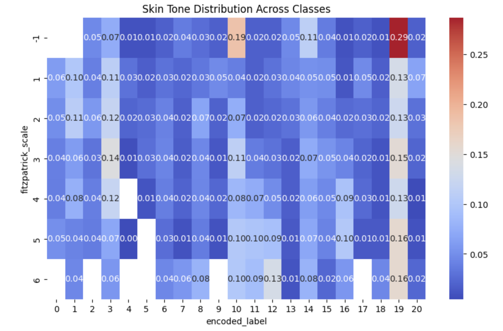

# GitHub Kaggle Project README

---

### **👥 Team Members**

| Name | GitHub Handle | Contribution |
| ----- | ----- | ----- |
| David Wang | @davidwang5 | Worked on CNN model, performed data augmentation |
| Kristal Hong | @khong707 | Worked on CNN model, performed data augmentation |
| Suzette Mejia | @suzettem16 | Worked on CNN model, performed data augmentation |
| Stella Huang | @stellahuang0527 | Worked on CNN model, performed data augmentation |

---

## **🎯 Project Highlights**

**Example:**

* Built a CNN-based deep learning model with transfer learning and fine-tuning to solve to classify dermatological conditions across diverse skin tones
* Achieved a ranking of 37 out of 73 on the Kaggle Leaderboard
* Used Grad-CAM to interpret model decisions to interpret model decisions
* Implemented image normalization to optimize results within compute constraints

🔗 [Equitable AI for Dermatology | Kaggle Competition Page](https://www.kaggle.com/competitions/bttai-ajl-2025/overview)
🔗 [WiDS Datathon 2025 | Kaggle Competition Page](https://www.kaggle.com/competitions/widsdatathon2025/overview)

---

## **👩🏽‍💻 Setup & Execution**

* To reproduce this project, first clone the repository using git clone https://github.com/your-username/dermatology-ai. Then, set up the environment by creating a virtual environment (e.g., using python -m venv env) and activating it.

* This project is designed to run in Kaggle Notebooks, so no local dataset downloads are necessary. 

* The dataset is automatically available via the competition page at /kaggle/input/bttai-ajl-2025/ once you join the Break Through Tech x Algorithmic Justice League competition on Kaggle.

---

## **🏗️ Project Overview**

* This project was developed as part of the Break Through Tech AI Program in collaboration with the Algorithmic Justice League through a Kaggle-hosted competition. The competition challenges participants to build inclusive machine learning models capable of classifying dermatological conditions from images across diverse skin tones. 
 * The primary objective is to address bias in dermatology AI tools, which historically underperform for people with darker skin due to underrepresentation in training data.
 * By creating a fairer and more accurate classification model, our work has the potential to reduce diagnostic errors, improve early detection, and promote equitable healthcare outcomes for marginalized communities. This project not only advances technical performance in medical AI but also contributes to broader efforts in algorithmic fairness and social impact.

---

## **📊 Data Exploration**

* Dataset: The dataset we used is a subset of the FitzPatrick17k dataset. This is a labeled collection of around 17,000 images that depict serious and cosmetic dermatological conditions such as melanoma and acne among a range of skin tones scored on the FitzPatrick skin tone scale. We took a sample of around 4,500 images from this dataset, which represented 21 skin conditions out of over 100.

* Data Exploration and Preprocessing: To begin exploring our data, we viewed the variety of images that contained skin conditions, as outlined by the "Evaluating Deep Neural Networks Trained on Skin Images with the Fitzpatrick 17k Dataset" video provided to us. We also examined the metadata provided to us as well as conducted our own research on how machine learning is currently being tested in real clinical settings to help with determining and treating dermatalogical conditions.

* After exploring the data and performing filename adjustments such as constructing file paths, we started data preprocessing beginning with using scikit-learn’s LabelEncoder to transform string labels into integers. We split the data into training and validation sets and used the ImageDataGenerator to preprocess image data by rescaling pixel values from their original range (0–255) to a normalized range. We used the helper function create_generator to generate batches of image data directly from the dataframe, and then were able to train a Keras Sequential CNN model.
  
* Challenges we faced: A major challenge that we faced when working with this dataset for our Kaggle competition was the fact that we needed to work with image data using convolutional neural networks instead of the traditional deep neural networks that we were used to using. In addition, we made a few assumptions about our data, in particular assuming that all images can be uniformly resized to the target size without losing critical information.

Visualizations:

## Skin Tone Across Classes

## Loss and Accuracy

---

## **🧠 Model Development**

We used two different models to make progress in achieving our primary goal of increasing classification accuracy among all skin tones. The first model was Convolutional Neural Networks (CNN), and the second was the pre-trained model EfficientNetB0. We prepared our data by splitting the training data set into 80% of training and 20% for the validation data set. Since our dataset contained images, we mostly focused on performing data augmentation techniques like rescaling, rotation, shift, and horizontal flip, as this was the input for our model. Additionally, some strategies we used to tune our model were changing the number of epochs and adding layers, such as Dropout. This allowed us to see different results for accuracy, loss, validation loss, and validation accuracy. 

Our first method was building a CNN model with multiple Conv2D, MaxPooling2D, Flatten, Dense, and Dropout layers to see if this was the best approach to achieve our goal. After some time of not seeing much improvement, we decided to use a different approach and use EfficientNetB0 as our final model. This included training the model by freezing the base layers and then training by unfreezing the base layers. By doing this method, our model learned more complex features from the image data. Although we didn't reach the accuracy we hoped for, we saw that pre-trained models can be more promising for our dataset and can help achieve higher image classification. 

---

## **📈 Results & Key Findings**

**Describe (as applicable):**

* Performance metrics (e.g., Kaggle Leaderboard score, F1-score)
* How your model performed overall
* How your model performed across different skin tones (AJL)
* Insights from evaluating model fairness (AJL)

**Potential visualizations to include:**

* Confusion matrix, precision-recall curve, feature importance plot, prediction distribution, outputs from fairness or explainability tools

---

## **🖼️ Impact Narrative**

**"_When you erase our data, you erase our stories. But when you include us, you illuminate our truths._" 
  – Inspired by the Algorithmic Justice League**

  In today's society, algorithmic bias has become one of the most pressing issues in the deployment of machine learning models, particularly in high-stakes fields like healthcare. As more clinical tools adopt AI-driven methods, it's critical that these systems are not only accurate, but also fair and inclusive. Historically, people with darker skin tones have been excluded or underrepresented in the training data for dermatology AI systems, leading to disparities in diagnostic accuracy. 

To address model fairness, several strategies grounded in ethical AI development were applied. We leveraged data augmentation techniques—including flipping, zooming, rotation, and brightness normalization—to diversify training images and reduce bias from overrepresented patterns. Applying class weighting to counterbalance skewed label distributions, ensured the model paid appropriate attention to underrepresented conditions. Our validation set maintained stratified representation of skin tones, enabling us to monitor model performance across the Fitzpatrick scale.

Beyond the model’s predictive capability, we utilized Grad-CAM visualizations to make model decisions interpretable and accessible. These heatmaps reveal where the model is focusing its attention in an image, allowing both researchers and non-technical stakeholders to evaluate whether the model’s rationale aligns with clinical intuition:

  The impact of this work lies in its potential to reduce diagnostic disparities in dermatology, particularly for patients with darker skin tones who are often misdiagnosed or underdiagnosed by AI systems. By building explainable and equitable tools, we contribute not only to technical fairness but to the democratization of healthcare innovation. Inspired by Dr. Randi’s call to integrate storytelling, we see our model as a way to connect data science with lived experience, helping bring representation and visibility to those historically excluded from medical AI.

---

## **🚀 Next Steps & Future Improvements**

* One of the limitations of our CNN model was that it could have had a higher accuracy score. We could have improved our model by introducing new training data as well as using better preprocessing techniques to balance the data before we trained a model.
* With more time and resources, we could have implemented a pre-trained model like ResNet, which would most likely have had a higher accuracy score than the base CNN model. By utilizing pre-trained models and transfer learning, we could achieve higher accuracy scores for our models.
* Additional techniques we could explore would include better hyperparameter tuning and dataset balancing. Given more time to implement the model, we could better study the data before we created our CNN model.

---

## **📄 References & Additional Resources**

* Dataset and Background Information: https://www.kaggle.com/competitions/bttai-ajl-2025

---

